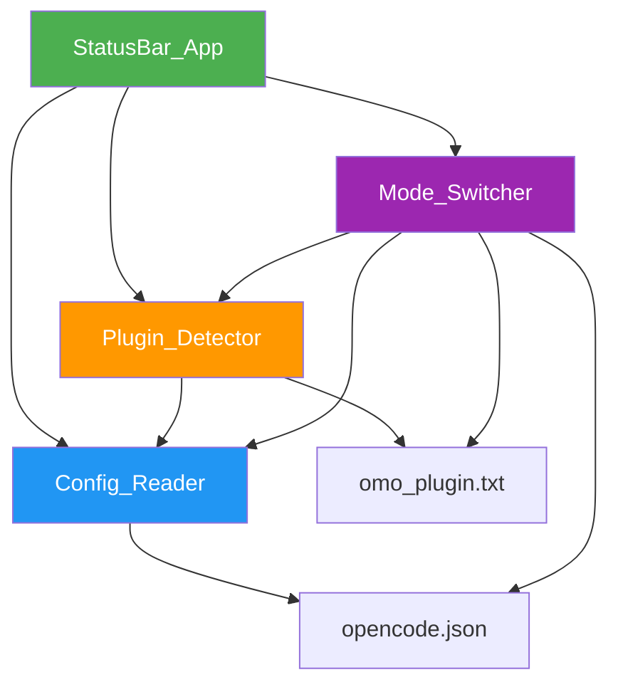
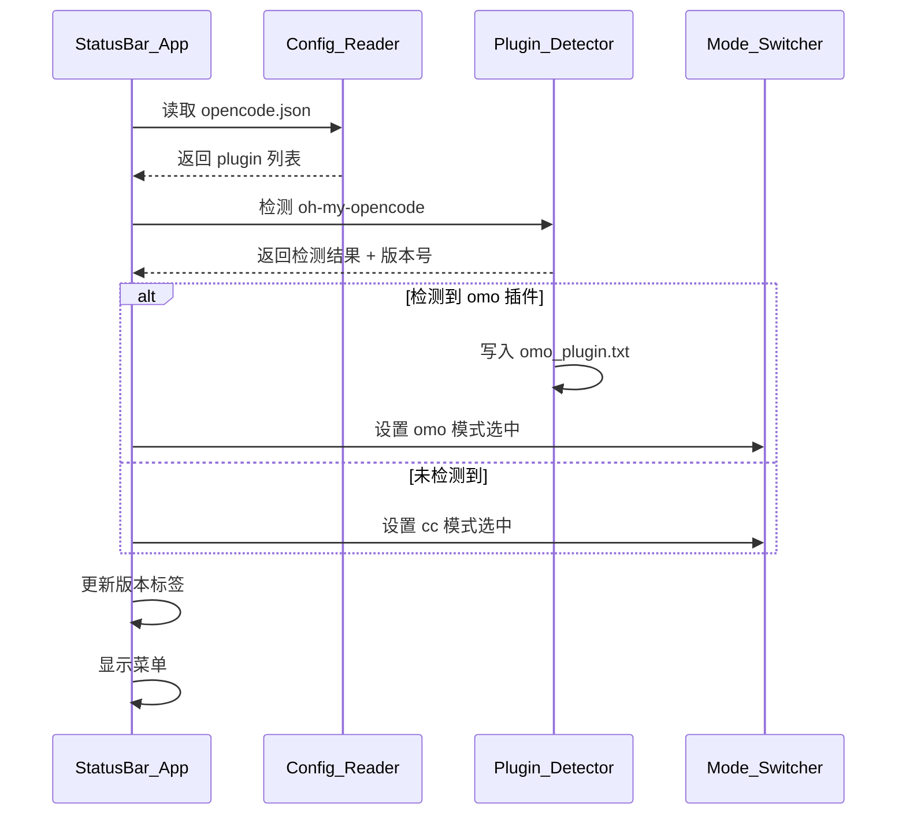

# 技术设计文档：macbar-omo-tool

## 概述

macbar-omo-tool 是一个 macOS 状态栏工具，用于管理 opencode 的 oh-my-opencode 插件配置。用户通过状态栏菜单可以查看插件版本、切换 cc/omo 模式，工具会自动读写 `~/.config/opencode/opencode.json` 中的 `plugin` 列表。

技术栈：Python + pyobjc (AppKit)，运行在 conda macbar 环境下。

### 设计决策

1. **单文件架构 vs 多模块架构**：采用多模块架构，将配置读取、插件检测、模式切换分离为独立模块，便于测试和维护。
2. **AppKit 菜单实现**：使用 `NSMenuItem` 的 `state` 属性实现单选效果（`NSOnState` / `NSOffState`），而非自定义 UI 控件。
3. **配置路径输入框**：使用 `NSTextField` 嵌入 `NSMenuItem` 的 `view` 属性实现菜单内文本输入。
4. **omo_plugin.txt 备份机制**：切换到 cc 模式时，将插件条目从 plugin 列表移除并备份到 omo_plugin.txt；切换回 omo 模式时，从 omo_plugin.txt 恢复。

## 架构

### 整体架构图



### 启动流程



## 组件与接口

### 1. StatusBar_App（主应用）

职责：创建状态栏图标、构建菜单、协调各模块。

```python
class StatusBarApp:
    """macOS 状态栏应用主体"""
    
    def __init__(self):
        """初始化应用，创建状态栏图标和菜单"""
        pass
    
    def build_menu(self) -> None:
        """构建下拉菜单：版本标签 → 路径输入框 → cc 单选 → omo 单选"""
        pass
    
    def update_version_label(self, version: str) -> None:
        """更新版本标签显示，格式：'omo版本：{version}'"""
        pass
    
    def on_mode_switch(self, sender) -> None:
        """单选项点击回调，触发模式切换"""
        pass
    
    def run(self) -> None:
        """启动应用主循环"""
        pass
```


### 2. Config_Reader（配置读取模块）

职责：读取、解析、写入 opencode.json 文件。

```python
class ConfigReader:
    """配置文件读写模块"""
    
    def __init__(self, config_path: str = "~/.config/opencode/opencode.json"):
        """初始化，设置配置文件路径"""
        pass
    
    def read_config(self) -> dict:
        """
        读取并解析 opencode.json。
        文件不存在或格式无效时返回空 dict。
        """
        pass
    
    def get_plugin_list(self) -> list[str]:
        """从配置中提取 plugin 列表，不存在时返回空列表"""
        pass
    
    def write_config(self, config: dict) -> None:
        """将修改后的配置写回 opencode.json"""
        pass
    
    def set_config_path(self, new_path: str) -> None:
        """更新配置文件路径"""
        pass
```

### 3. Plugin_Detector（插件检测模块）

职责：在 plugin 列表中查找 oh-my-opencode，提取版本号，管理 omo_plugin.txt。

```python
class PluginDetector:
    """oh-my-opencode 插件检测模块"""
    
    @staticmethod
    def find_omo_plugin(plugin_list: list[str]) -> str | None:
        """
        在 plugin 列表中查找包含 'oh-my-opencode' 的条目。
        找到返回完整字符串（如 'oh-my-opencode@3.7.4'），否则返回 None。
        """
        pass
    
    @staticmethod
    def extract_version(plugin_entry: str) -> str | None:
        """
        从插件条目中提取 '@' 后的版本号。
        如 'oh-my-opencode@3.7.4' → '3.7.4'。
        如 'oh-my-opencode@latest' → 'latest'（非语义化版本号，原样返回）。
        无 '@' 或格式异常返回 None。
        """
        pass
    
    @staticmethod
    def save_plugin_entry(config_dir: str, plugin_entry: str) -> None:
        """将插件条目写入 config_dir/omo_plugin.txt"""
        pass
    
    @staticmethod
    def load_plugin_entry(config_dir: str) -> str | None:
        """从 config_dir/omo_plugin.txt 读取插件条目，不存在返回 None"""
        pass
```

### 4. Mode_Switcher（模式切换模块）

职责：处理 cc/omo 单选切换逻辑，修改 plugin 列表并写回配置。

```python
class ModeSwitcher:
    """cc/omo 模式切换模块"""
    
    def __init__(self, config_reader: ConfigReader, plugin_detector: PluginDetector):
        """初始化，注入依赖"""
        pass
    
    def switch_to_cc(self) -> None:
        """
        切换到 cc 模式：
        1. 从 plugin 列表中移除 oh-my-opencode 条目
        2. 将该条目备份到 omo_plugin.txt
        3. 写回配置
        """
        pass
    
    def switch_to_omo(self) -> None:
        """
        切换到 omo 模式：
        1. 从 omo_plugin.txt 读取备份的插件条目
        2. 将该条目添加回 plugin 列表
        3. 写回配置
        """
        pass
    
    def get_current_mode(self) -> str:
        """检测当前模式，返回 'cc' 或 'omo'"""
        pass
```

## 数据模型

### opencode.json 结构（相关部分）

```json
{
  "$schema": "https://opencode.ai/config.json",
  "model": "bytecatcode-codex/gpt-5.2-codex-high",
  "plugin": ["oh-my-opencode@3.7.4"],
  "provider": { "..." },
  "mcp": { "..." }
}
```

关键字段：
- `plugin`：字符串数组，每个元素格式为 `{插件名}@{版本号}` 或 `{插件名}@latest`
- 版本号可以是语义化版本（如 `3.7.4`）或特殊标识（如 `latest`）
- 工具只操作 `plugin` 字段，其他字段原样保留

### omo_plugin.txt

纯文本文件，存储单行内容，即 oh-my-opencode 的完整插件条目字符串。

示例内容：
```
oh-my-opencode@3.7.4
```

### 内部状态模型

```python
# 应用运行时状态
class AppState:
    config_path: str          # 当前配置文件路径
    plugin_list: list[str]    # 当前 plugin 列表
    current_mode: str         # 'cc' 或 'omo'
    omo_version: str | None   # 检测到的版本号，如 '3.7.4'
    omo_entry: str | None     # 完整插件条目，如 'oh-my-opencode@3.7.4'
```


## 正确性属性

*属性是指在系统所有有效执行中都应成立的特征或行为——本质上是对系统应做什么的形式化陈述。属性是人类可读规格说明与机器可验证正确性保证之间的桥梁。*

### 属性 1：版本号提取正确性

*对于任意*包含 "@" 的插件条目字符串（格式为 `{name}@{version}`），`extract_version` 提取的版本号应等于 "@" 之后的子串。

**验证需求：2.3**

### 属性 2：版本标签格式化

*对于任意*版本号字符串（包括 None），格式化后的版本标签应匹配 `"omo版本：{version}"` 模式，其中 version 为传入的版本号或 "None"。

**验证需求：2.1, 2.2**

### 属性 3：单选互斥性

*对于任意*初始模式状态（cc 或 omo），切换到某一模式后，该模式应为选中状态，另一模式应为未选中状态。即 `get_current_mode()` 的返回值始终为 "cc" 或 "omo" 之一。

**验证需求：4.2, 4.3**

### 属性 4：配置路径更新生效

*对于任意*有效文件路径字符串，调用 `set_config_path(path)` 后，`ConfigReader` 后续读取操作应使用该新路径。

**验证需求：3.3**

### 属性 5：plugin 列表解析正确性

*对于任意*包含 "plugin" 键的有效 JSON 配置（其中 "plugin" 值为字符串数组），`get_plugin_list()` 返回的列表应与 JSON 中 "plugin" 键的值完全一致。

**验证需求：5.2**

### 属性 6：无效配置容错

*对于任意*不存在的文件路径或非法 JSON 内容，`read_config()` 应返回空 dict，`get_plugin_list()` 应返回空列表，且不抛出异常。

**验证需求：5.3**

### 属性 7：oh-my-opencode 检测正确性

*对于任意*字符串列表，`find_omo_plugin()` 返回非 None 当且仅当列表中存在包含 "oh-my-opencode" 子串的元素，且返回值为该元素的完整字符串。

**验证需求：6.1**

### 属性 8：插件条目备份 round-trip

*对于任意*有效的插件条目字符串，调用 `save_plugin_entry(dir, entry)` 后再调用 `load_plugin_entry(dir)`，应返回与原始条目相同的字符串。

**验证需求：6.2**

### 属性 9：自动模式检测一致性

*对于任意* plugin 列表，`get_current_mode()` 返回 "omo" 当且仅当列表中包含 "oh-my-opencode" 子串的元素；否则返回 "cc"。

**验证需求：7.1, 7.2**

## 错误处理

### 配置文件错误

| 场景 | 处理方式 |
|------|---------|
| opencode.json 不存在 | 返回空 dict，plugin 列表视为空，模式默认 cc |
| opencode.json 格式无效（非 JSON） | 同上，记录警告日志 |
| opencode.json 缺少 "plugin" 键 | plugin 列表视为空列表 |
| "plugin" 值不是数组 | plugin 列表视为空列表 |

### 文件写入错误

| 场景 | 处理方式 |
|------|---------|
| 无写入权限 | 捕获异常，显示错误提示，不改变当前状态 |
| 磁盘空间不足 | 同上 |
| omo_plugin.txt 不存在（切换到 omo 时） | 提示用户无法恢复插件条目，保持 cc 模式 |

### 插件条目格式错误

| 场景 | 处理方式 |
|------|---------|
| 插件条目不含 "@" | `extract_version` 返回 None，版本标签显示 "None" |
| 插件条目 "@" 后为空 | 版本号视为空字符串 |
| 插件条目 "@" 后为 "latest" | 版本标签显示 "omo版本：latest" |

## 测试策略

### 单元测试

使用 `pytest` 框架，覆盖以下场景：

- **ConfigReader**：
  - 正常读取有效 JSON 配置
  - 读取不存在的文件返回空 dict
  - 读取非法 JSON 返回空 dict
  - 缺少 "plugin" 键返回空列表
  - 默认路径为 `~/.config/opencode/opencode.json`

- **PluginDetector**：
  - 从包含 omo 的列表中找到插件条目
  - 从不包含 omo 的列表中返回 None
  - 提取 "oh-my-opencode@3.7.4" 的版本号为 "3.7.4"
  - 提取 "oh-my-opencode@latest" 的版本号为 "latest"
  - 无 "@" 的条目返回 None

- **ModeSwitcher**：
  - 切换到 cc 模式后 plugin 列表不含 omo
  - 切换到 omo 模式后 plugin 列表包含 omo
  - 切换到 cc 再切换回 omo 恢复原始条目

### 属性测试

使用 `hypothesis` 库，每个属性测试至少运行 100 次迭代。

每个测试用注释标注对应的设计属性：

```python
# Feature: macbar-omo-tool, Property 1: 版本号提取正确性
@given(name=text(min_size=1), version=text(min_size=1))
def test_extract_version_property(name, version):
    entry = f"{name}@{version}"
    assert PluginDetector.extract_version(entry) == version
```

属性测试覆盖：

| 属性 | 测试描述 | 生成器策略 |
|------|---------|-----------|
| 属性 1 | 版本号提取 | 生成随机 `name@version` 字符串 |
| 属性 2 | 版本标签格式化 | 生成随机版本号字符串和 None |
| 属性 3 | 单选互斥性 | 生成随机初始状态和切换序列 |
| 属性 4 | 路径更新生效 | 生成随机文件路径字符串 |
| 属性 5 | plugin 列表解析 | 生成包含 "plugin" 键的随机 JSON |
| 属性 6 | 无效配置容错 | 生成随机非 JSON 字符串和不存在的路径 |
| 属性 7 | omo 检测正确性 | 生成随机字符串列表（含/不含 omo） |
| 属性 8 | 插件条目备份 round-trip | 生成随机插件条目字符串 |
| 属性 9 | 自动模式检测 | 生成随机 plugin 列表 |

### 测试依赖

```
# requires: pytest>=7.0
# requires: hypothesis>=6.0
```
